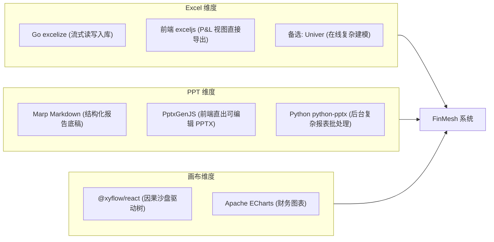
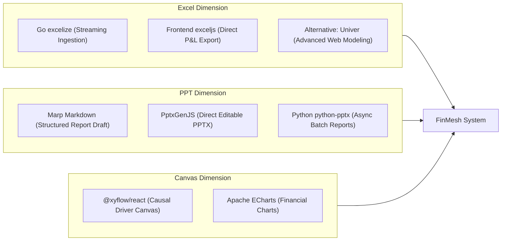

# Excel、PPT 与 Canvas 画布库选型与使用边界调研报告 / Excel, PPT & Canvas Libraries Research

[中文](#中文) | [English](#english)

---

## 中文版本

- **来源编号**：`SRC-0021`
- **登记日期**：2026-09-17
- **主题**：面向 FinMesh 的 Excel 数据导入导出、PPT 报告生成与 Canvas 画布推演技术选型

---

## 1. Excel 领域：后端流式读写与前端表格

财务工作流高度依赖电子表格。FinMesh 需覆盖服务端解析、前端多维表格导出与桌面插件接口：

| 开源项目 | 技术栈 / 协议 | 许可特性与功能能力 | 在 FinMesh 中的具体应用场景 |
| :--- | :--- | :--- | :--- |
| `excelize` (`qax-os/excelize`) | Go BSD-3-Clause | 1. 宽松开源协议，代码可自由闭源商用。 2. 支持流式读写（Stream Reader/Writer），处理数十万行总账分录时内存占用低。 3. 支持单元格样式、公式、图表与数据透视表元数据解析。 | **Go 后端文件解析器**：用户拖拽上传财务 GL 流水或预算模板时，流式解析数据并写入 DuckDB 事实表。 |
| `Univer` (`dream-num/univer`) | TypeScript Apache 2.0 | 1. 模块化协同 Office 框架，覆盖表格、文档与幻灯片。 2. Canvas 渲染底座，支持协同编辑与复杂公式计算引擎。 | **Web 端复杂表格备选方案**：若用户需要高自由度在线公式编辑与类 Excel 操控时集成。 |
| `exceljs` | TypeScript / Node MIT | 1. 纯前端/Node 电子表格生成库，无外部运行时依赖。 2. 支持单元格样式、数据校验与冻结窗格配置。 | **前端客户端导出**：浏览器端直接将多维损益表网格导出为格式化 `.xlsx` 文件，减少服务端网络往返。 |
| `Office.js` | Microsoft 官方 SDK | 微软 Office Web Add-ins 标准通信协议。 | **桌面插件接口**：构建 Excel 365 桌面伴生插件，实现本地表格与云端受控模型双向同步。 |

---

## 2. PPT 领域：经营分析报告与演示幻灯片生成

财务分析师月结后需出具经营分析述职材料。系统通过结构化指标与文字归因自动装配可编辑幻灯片：

| 开源项目 | 技术栈 / 协议 | 许可特性与功能能力 | 在 FinMesh 中的具体应用场景 |
| :--- | :--- | :--- | :--- |
| `PptxGenJS` (`gitbrent/PptxGenJS`) | TypeScript / JS MIT | 1. 纯前端运行的幻灯片生成库，无需服务端渲染进程。 2. 直接生成原生可编辑 `.pptx` 文件，支持母版、矢量图形、原生图表（柱状图/折线图）与表格。 | **前端一键导出原生 PPT**：将 AI 归因结论与 Waterfall 图表组装为标准 `.pptx` 供财务人员下载微调。 |
| `python-pptx` | Python MIT | 1. Python 生态成熟的 PPT 处理库。 2. 支持在企业既有品牌模板（Template）的占位符中填充数据与图表。 | **Python 算法微服务批量出图**：后台批量生成包含多事业部图表的月度经营分析完整报告。 |
| `Marp` (`marp-team/marp`) | Markdown 生态 MIT | 1. 基于 Markdown 与 YAML 配置的幻灯片渲染工具。 2. 支持导出为 HTML 演示文稿、PDF 与 PPTX。 | **AI 结构化输出桥梁**：大模型直接输出 Marp 格式报告，前端可在网页端直接全屏幻灯片播放。 |
| `reveal.js` | JavaScript MIT | HTML 演示文稿框架，支持内嵌交互式 React 图表。 | **Web 端沉浸式述职模式**：在浏览器中全屏汇报，演示过程中支持交互点击数字穿透至底层流水。 |

---

## 3. Canvas 领域：因果沙盘推演与流程建模

FinMesh 提供图形化沙盘推演，将单维报表提升为直观的因果驱动网络：

| 开源项目 | 技术栈 / 协议 | 许可特性与功能能力 | 在 FinMesh 中的具体应用场景 |
| :--- | :--- | :--- | :--- |
| `@xyflow/react` (React Flow) | React / TypeScript MIT | 1. 节点式 UI 与有向无环图（DAG）工程库。 2. 支持自定义节点内嵌控件（滑块、输入框、迷你图表）与连接线。 3. 内置视口变换与拖拽吸附逻辑。 | **【确定选型】FinMesh What-If 因果沙盘主画布**：渲染 ARR、CAC、Runway 因果驱动树，集成推演滑块。 |
| `tldraw` | React / TypeScript Apache 2.0 (SDK) | 1. 无限画布（Infinite Canvas）白板库。 2. 支持图形绘制、便签注释与协同光标。 | **战略讨论草稿纸备选**：用于非结构化的架构草图与业务流程研讨。 |
| `Konva` / `react-konva` | JavaScript / React MIT | 1. 基于 HTML5 2D Canvas 的高性能图形库。 2. 包含完整的场景图树（Stage、Layer、Group、Shape）与事件系统。 | **高密度图形渲染备选**：当沙盘节点规模达到数千个时，替代 DOM 解决渲染性能瓶颈。 |
| `Fabric.js` | JavaScript MIT | HTML5 Canvas 对象模型库，支持多对象变换与格式导出。 | **看板长图导出**：将 PVM 方差分解看板合成为高分辨率长图供离线传阅。 |

---

## 4. FinMesh 核心选型方案

1. **Excel 方案**：
   - 后端使用 `excelize`：流式解析用户上传的明细流水并写入 DuckDB。
   - 前端使用 `exceljs`：在浏览器端直接生成格式化 `.xlsx` 文件下载。
2. **PPT 方案**：
   - 前端集成 `PptxGenJS`：将图表与归因文字组装为原生 `.pptx` 下载。
   - 内部交互支持 `Marp` 结构化格式：大模型输出直接渲染为网页端全屏演示。
3. **Canvas 方案**：
   - 核心采用 `@xyflow/react`：建立节点式驱动树，在节点内直接挂载推演滑块与 ECharts 微型图表。

---

## English Version

- **Source ID**: `SRC-0021`
- **Date**: 2026-09-17
- **Subject**: Evaluation of Excel data I/O, PPT report generation, and Canvas simulation libraries for FinMesh

---

### 1. Excel Domain: Backend Streaming I/O and Frontend Grids

Finance workflows depend heavily on spreadsheets. FinMesh must support server-side ingestion, browser-side multi-dimensional export, and desktop add-in interfaces:

| Project | Stack / License | License Characteristics & Functional Capabilities | Specific Application Scenario in FinMesh |
| :--- | :--- | :--- | :--- |
| `excelize` (`qax-os/excelize`) | Go BSD-3-Clause | 1. Permissive open source, embeddable in commercial closed-source SaaS. 2. Stream Reader/Writer support with low memory footprint across hundreds of thousands of GL rows. 3. Parses cell styles, formulas, charts, and pivot metadata. | **Go Backend File Parser**: Stream-parses user-uploaded GL ledgers and budget templates into DuckDB fact tables. |
| `Univer` (`dream-num/univer`) | TypeScript Apache 2.0 | 1. Modular collaborative office framework covering sheets, docs, and slides. 2. Canvas-based rendering with collaborative editing and formula calculation engines. | **Web Complex Spreadsheet Alternative**: For scenarios requiring advanced online formula modeling and Excel-like desktop mechanics. |
| `exceljs` | TypeScript / Node MIT | 1. Pure frontend/Node spreadsheet generation library without external runtime dependencies. 2. Supports cell styles, data validation, and frozen panes. | **Client-Side Browser Export**: Generates styled `.xlsx` workbooks directly in the browser, minimizing server roundtrips. |
| `Office.js` | Microsoft Official SDK | Official Microsoft Office Web Add-ins communication protocol. | **Desktop Add-in Interface**: Powers Excel 365 desktop companion add-in for bidirectional synchronization between workbooks and cloud models. |

---

### 2. PPT Domain: Executive Presentation & Management Memo Generation

Finance analysts produce monthly operational presentations for management. The platform dynamically binds structured metrics and narrative attributions into editable presentations:

| Project | Stack / License | License Characteristics & Functional Capabilities | Specific Application Scenario in FinMesh |
| :--- | :--- | :--- | :--- |
| `PptxGenJS` (`gitbrent/PptxGenJS`) | TypeScript / JS MIT | 1. Pure browser-side slide generation library without server rendering dependencies. 2. Produces native, editable `.pptx` decks with master slides, shapes, native charts, and tables. | **Frontend One-Click PPT Export**: Packages AI variance narratives and waterfall charts into `.pptx` files for analyst fine-tuning. |
| `python-pptx` | Python MIT | 1. Mature Python PPT automation library. 2. Populates corporate brand templates by injecting charts and tables into designated slide placeholders. | **Python Algorithm Sidecar Batch Decking**: Generates multi-division monthly operational packs in asynchronous background jobs. |
| `Marp` (`marp-team/marp`) | Markdown Ecosystem MIT | 1. Markdown- and YAML-driven slide rendering engine. 2. Exports to HTML web presentations, PDF, and PPTX. | **AI Structured Output Bridge**: Direct target format for LLM report generation, rendered as interactive fullscreen slides in Web UI. |
| `reveal.js` | JavaScript MIT | HTML presentation framework supporting interactive embedded React charts. | **Web Immersive Presentation Mode**: Fullscreen browser deck supporting live click-through to underlying transaction drawers. |

---

### 3. Canvas Domain: Causal Sandbox Simulation & Process Modeling

FinMesh delivers graphical scenario modeling, transforming static tables into intuitive causal driver graphs:

| Project | Stack / License | License Characteristics & Functional Capabilities | Specific Application Scenario in FinMesh |
| :--- | :--- | :--- | :--- |
| `@xyflow/react` (React Flow) | React / TypeScript MIT | 1. Node-based UI and DAG engineering library. 2. Supports custom nodes embedding interactive controls (sliders, inputs, sparklines) and custom edges. 3. Native viewport transforms and drag-and-drop snapping. | **[Selected Core] FinMesh What-If Driver Canvas**: Renders ARR, CAC, and Runway causal trees with live simulation sliders. |
| `tldraw` | React / TypeScript Apache 2.0 (SDK) | 1. Infinite canvas whiteboard library. 2. Supports freehand drawing, sticky notes, and multiplayer cursors. | **Strategic Scratchpad Alternative**: Non-structured architectural sketches and collaborative workflow discussions. |
| `Konva` / `react-konva` | JavaScript / React MIT | 1. High-performance HTML5 2D canvas library. 2. Complete scenegraph hierarchy (Stage, Layer, Group, Shape) with event delegation. | **High-Density Render Alternative**: Bypasses DOM performance boundaries when canvas driver graphs exceed thousands of nodes. |
| `Fabric.js` | JavaScript MIT | HTML5 Canvas object model with format serialization and transformations. | **Dashboard Graphic Export**: Synthesizes high-resolution PVM variance dashboards into image files for offline sharing. |

---

### 4. FinMesh Core Technology Architecture

1. **Excel Architecture**:
   - Backend: `excelize` for high-throughput streaming ingestion into DuckDB.
   - Frontend: `exceljs` for direct in-browser formatted `.xlsx` generation.
2. **PPT Architecture**:
   - Frontend: `PptxGenJS` to compile charts and memos into editable native `.pptx` slides.
   - Internal Rendering: `Marp` structured Markdown format for live web-native deck reviews.
3. **Canvas Architecture**:
   - Core: `@xyflow/react` for the interactive driver tree, embedding dynamic simulation sliders and ECharts sparklines inside custom nodes.

