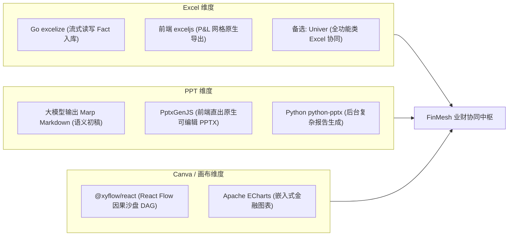

# Excel、PPT 与 Canvas 画布生态开源库选型与商业边界调研报告

- **来源编号**：`SRC-0021`
- **登记日期**：2026-09-17
- **主题**：面向 FinMesh 业财工作台的 Excel 深度集成、自动化经营汇报 PPT 生成与 Canvas 因果沙盘推演开源库全景审查

---

## 一、Excel 领域：后端流式读写、Web 在线表格与双向联动

财务人员的核心生产力依然高度依附于 Excel。FinMesh 需要在**后端极速解析导入**、**前端 Web 级类 Excel 表格体验**以及**未来桌面端插件联动**上建立完整工具链：

| 开源项目 | 技术栈 / 协议 | 核心能力与商业友好度 | 在 FinMesh 中的具体应用场景 |
| :--- | :--- | :--- | :--- |
| **`excelize`** (`qax-os/excelize`) | **Go** BSD-3-Clause | 1. Go 语言中最成熟、功能最完备的电子表格库。 2. 极度商业友好，支持超大文件的流式读写（Stream Reader/Writer），内存占用极低。 3. 完美兼容复杂的单元格样式、公式、图表与透视表元数据。 | **Go 核心后端导入导出引擎**：在用户拖拽上传数万行财务 GL 流水或预算模板时，流式高效解析并批量写入 DuckDB，绝不产生 OOM。 |
| **`Univer`** (`dream-num/univer`) | **TypeScript** Apache 2.0 | 1. 新一代全栈、现代化的企业级协同 Office 框架（涵盖 Sheets、Docs、Slides）。 2. 纯 Canvas 渲染引擎，性能媲美 Google Sheets，架构模块化且高度可扩展。 3. 开箱即用支持复杂财务公式计算引擎、条件格式与协同编辑。 | **Web 端高级多维建模工作台备选**：当用户需要深度类似 Excel 的全功能在线编辑与自由公式编排时，作为嵌入式无缝表格核心。 |
| **`exceljs`** | **TypeScript / Node** MIT | 1. 前后端通用的现代 XLSX 处理库。 2. 支持丰富的单元格样式定义、数据验证（Data Validation）与冻结窗格。 | **前端客户端零服务端导出**：在浏览器端直接将当前多维 P&L 网格视图渲染导出为带样式的原生 `.xlsx` 文件。 |
| **`Office.js`** | **Microsoft 官方 SDK** | 微软官方提供的 Office Web Add-ins 标准开发协议。 | **未来双向桌面端插件底座**：对标 Datarails / Cube，构建本地 Excel 365 插件，从 FinMesh 云端拉取受控模型。 |

---

## 二、PPT 领域：AI 自动化经营汇报 Deck 与管理层幻灯片生成

Finance BP 的最大痛点之一是月结后需要耗费数天手工制作汇报 PPT（Variance Analysis Deck）。FinMesh 需要一套能将**结构化图表 + AI 归因文字**一键编织为可编辑真实 PPTX 的引擎：

| 开源项目 | 技术栈 / 协议 | 核心能力与商业友好度 | 在 FinMesh 中的具体应用场景 |
| :--- | :--- | :--- | :--- |
| **`PptxGenJS`** (`gitbrent/PptxGenJS`) | **TypeScript / JS** MIT | 1. 全球最流行的纯 JS/TS 幻灯片生成库，纯前端或 Node 环境均可运行。 2. **直接生成原生可编辑的 `.pptx` 文件**，支持幻灯片母版、矢量形状、原生数据图表（柱状图、折线图）、表格与富文本。 3. 极度商业友好，无任何外部服务端依赖。 | **前端一键导出原生 PPT 核心库**：AI Agent 撰写完月结经营分析后，前端调用该库将 Waterfall 图表与文字分析瞬间组装为真实高管 PPT。 |
| **`python-pptx`** | **Python** MIT | 1. Python 生态中最成熟的企业级 PPT 生成与模板插槽填充库。 2. 完美支持在现有企业品牌模板（Brand Template）的占位符中精准替换数字与图表。 | **Python 算法 Sidecar 离线报告生成**：当需要后台批量自动化生成包含数十个事业部复杂图表的月度经营分析大包时使用。 |
| **`Marp`** (`marp-team/marp`) | **Markdown 生态** MIT | 1. 现代化 Markdown 幻灯片渲染生态，通过简单 YAML 指令与标准 Markdown 即可生成精美幻灯片。 2. 支持一键导出为 HTML 演示文稿、高保真 PDF 以及 PPTX。 | **AI Agent 结构化输出桥梁**：大模型最擅长输出结构化 Markdown。AI 直接生成 Marp 格式的述职底稿，前端可秒级完成全屏幻灯片在线播放与转绘。 |
| **`reveal.js`** | **JavaScript** MIT | 经典 HTML 演示文稿框架，支持丰富的转场动效与幻灯片内嵌交互式 React 图表。 | **Web 端全屏高管沉浸式述职模式**：在浏览器中直接全屏演示，观众可在幻灯片中直接交互点击数字下钻。 |

---

## 三、Canva / Canvas 领域：因果沙盘推演、无限白板与可视化建模

FinMesh 的核心差异化在于**“敏捷因果沙盘画布”**。这需要将传统的单维报表提升为直观的业务驱动因子网络：

| 开源项目 | 技术栈 / 协议 | 核心能力与商业友好度 | 在 FinMesh 中的具体应用场景 |
| :--- | :--- | :--- | :--- |
| **`@xyflow/react`** (React Flow) | **React / TypeScript** MIT | 1. 节点式 UI 与有向无环图（DAG）事实标准，工业级成熟度。 2. 支持完全自定义节点（可在节点内嵌入滑块、微型折线图、输入框）、自定义连接线。 3. 内置高性能视口缩放、平移与连线吸附算法。 | **【确定选型】FinMesh What-If 因果沙盘主画布**：可视化构建 ARR、CAC、Runway 因果驱动树，承载动态滑块与实时重算。 |
| **`tldraw`** | **React / TypeScript** Apache 2.0 (SDK) | 1. 现代化无限画布（Infinite Canvas）与手势白板系统。 2. 支持极度平滑的图形绘制、富文本注释与协同光标跟随。 | **CFO 战略沙盘草稿纸备选**：用于提供更自由的涂鸦、批注与架构概念草图讨论。 |
| **`Konva` / `react-konva`** | **JavaScript / React** MIT | 1. 专注于 2D 高性能高性能图形渲染的 Canvas 库。 2. 支持场景图树形结构（Stage、Layer、Group、Shape）、事件驱动与像素级滤镜。 | **超高性能图形复合渲染底座**：若未来沙盘节点数量突破数千个导致 DOM 瓶颈时，作为底层 Canvas 渲染引擎。 |
| **`Fabric.js`** | **JavaScript** MIT | 强大的 HTML5 Canvas 对象模型库，支持交互式对象选择、拖拽拉伸、图层混合与导出为 SVG/PNG。 | **海报与经营看板长图导出**：一键将当前数据大屏或方差图表拼装合成为高保真长图并导出分享。 |

---

## 四、FinMesh 最终工程技术搭配组合推荐

基于上述调研，FinMesh 在各维度的最佳技术选型组合锁定如下：

1. **Excel 选型**：
   - 后端统一使用 **`qax-os/excelize` (BSD-3-Clause)**：极速流式解析上传的庞大数据流水，防爆内存。
   - 前端集成 **`exceljs` (MIT)**：实现表格视图即时导出，免除服务端网络往返。
2. **PPT 选型**：
   - 前端优先集成 **`PptxGenJS` (MIT)**：将 AI BP 归因文字与 Waterfall 图表一键打包为标准的 `.pptx` 文件，财务人员下载后可在本地 Office 中直接微调。
   - 内部交互层支持 **`Marp` (MIT)**：作为 AI 述职报告的标准结构化格式，天生支持 Web 全屏沉浸式高管汇报。
3. **Canvas 选型**：
   - 核心继续坚定采用 **`@xyflow/react` (MIT)**：与 dbt / 因果 DAG 在数据模型上天然同构，自定义节点完美承载 What-If 动态滑块。
