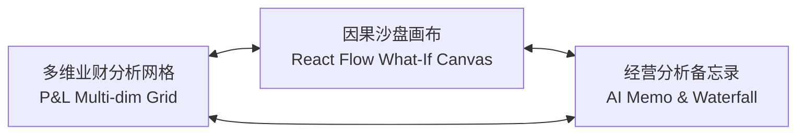
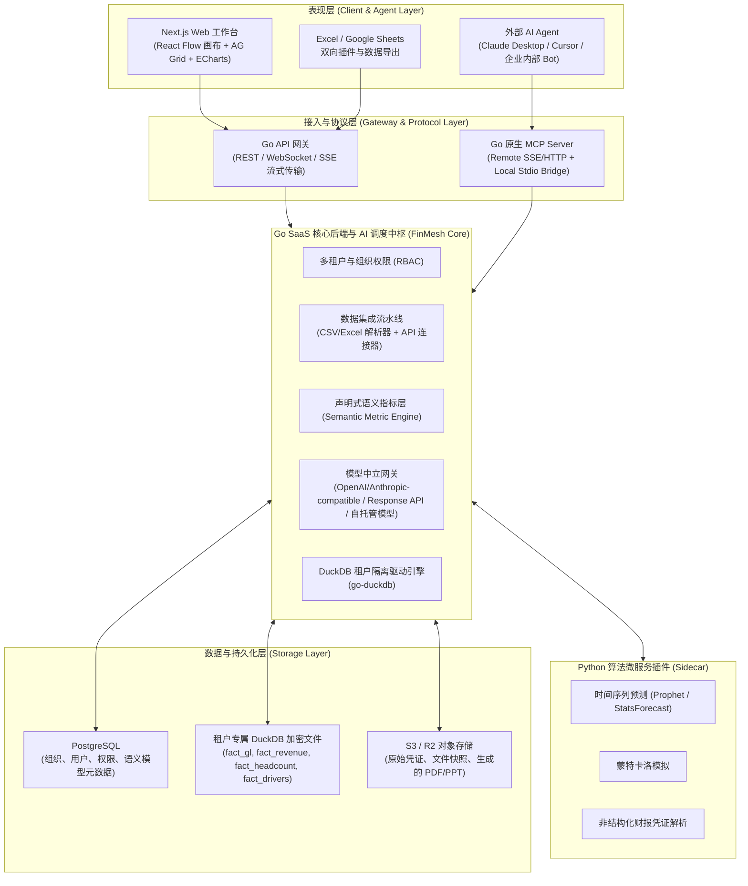
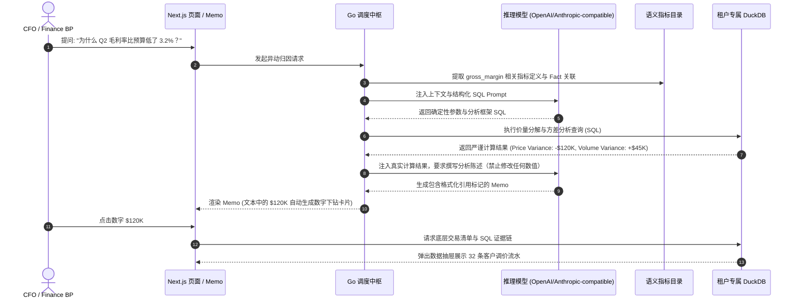
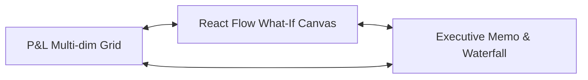
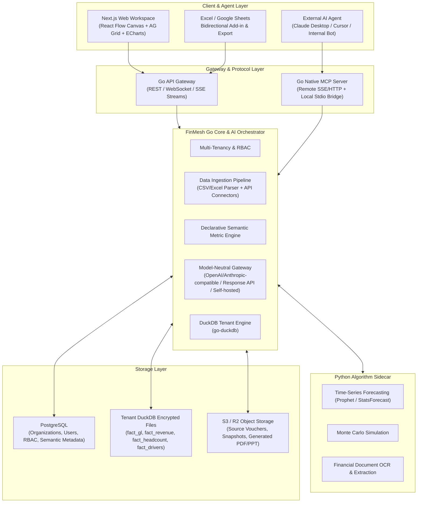

# FinMesh 架构与产品白皮书 / Architecture & Product Whitepaper

[中文](#中文) | [English](#english)

---

<a name="中文"></a>
## 中文白皮书

> 面向 FP&A 与财务 BP 的业财协同与沙盘推演系统，提供分析工作台与 MCP 接口。


## 目录

- [1. 产品定位与解决问题](#1-产品定位与解决问题)
- [2. 目标客群与痛点解法 (ICP)](#2-目标客群与痛点解法-icp)
- [3. 核心交互模式](#3-核心交互模式)
- [4. 系统整体架构与技术选型](#4-系统整体架构与技术选型)
- [5. 数值确定性与审计穿透](#5-数值确定性与审计穿透)
- [6. 业财数据模型与声明式指标层](#6-业财数据模型与声明式指标层)
- [7. Financial MCP Server 规范](#7-financial-mcp-server-规范)
- [8. 技术栈清单](#8-技术栈清单)
- [9. MVP 交付范围与开发路线图](#9-mvp-交付范围与开发路线图)

---

## 1. 产品定位与解决问题

企业财务规划与分析（FP&A）及业务财务伙伴（Finance BP）日常面临三项主要限制：
1. **数据口径割裂**：总账科目（GL）、业务系统订单（Stripe/Shopify/CRM）与人事编制表格口径不一，月结时分析师需要耗费大量时间手工清洗与核对跨系统表格。
2. **模型维护困难**：传统电子表格公式容易破损，复杂的跨期测算难以响应管理层实时的“What-If”沙盘推演需求。
3. **大模型计算幻觉**：大模型直接做数值计算容易出现心算偏差，且缺少数据溯源链路，无法满足审计与管理层核验要求。

**FinMesh 的定位**：
FinMesh 是一套面向财务分析与业务协同的软件系统。系统基于确定性 SQL 计算，提供图形化因果沙盘与结构化归因分析，同时通过标准 MCP 协议向外部智能体暴露财务指标查询与推演能力。

---

## 2. 目标客群与痛点解法 (ICP)

FinMesh 兼顾成长期企业（Scale-up / Mid-Market）与中小企业（SMB）：

| 维度 | Scale-up / Mid-Market (100 - 1000 人) | 高成长 SMB / 出海企业 (< 100 人) |
| :--- | :--- | :--- |
| **典型特征** | 业务迭代快、设专职 Finance BP，需要跨部门协同 | 追求轻量精简、即插即用、重视现金流与跑道控制 |
| **核心痛点** | 跨部门数据口径不一、预实偏差（Variance）分析耗时长、预算审批流程复杂 | 缺少专职财务分析师、表格模板混乱、难以实时掌握现金流健康度 |
| **FinMesh 解法** | 自动生成方差归因瀑布图（Waterfall）、多维权限隔离、标准 API 与数仓连接 | 拖拽文件批量入库、内置标准 SaaS/电商指标模板、实时现金跑道监控 |

---

## 3. 核心交互模式

系统提供三项联动的工作流模块：



### 3.1 因果沙盘画布 (Visual What-If Driver Canvas)
- 基于 React Flow 构建因果驱动有向无环图（DAG）。
- 历史期节点绑定底层事实表（Actuals）；未来预测期节点转化为带有数值滑块的驱动因子。
- 调整滑块数值（如“获客成本调整 +15%”或“推迟 2 个月招聘”），系统在 100ms 内重算损益表与现金跑道，并支持 Base、Bull、Bear 三种情景同屏对比。

### 3.2 多维业财分析网格 (Dynamic Financial Grid)
- 基于 AG Grid 构建的多维报表视图，保留类似 Excel 的操控习惯。
- 支持行列切片（Slice & Dice）、层级折叠、版本对比（Actual vs Budget / Forecast），并支持双向 Excel / Google Sheets 导出与导入。

### 3.3 经营分析备忘录与归因 (Executive Memo & Variance Diagnosis)
- 月结时自动运行量价方差分解，定位根本驱动因子（价量差异、部门超支、转化漏斗变动），生成带 Waterfall 瀑布图与业务建议的文字备忘录。
- **数字穿透审计**：文档中的所有数值均带有原始数据链接，点击可打开抽屉查看对应的 SQL 查询与明细账分录。

---

## 4. 系统整体架构与技术选型

FinMesh 采用 **Go 核心系统 + Python 算法插件 + 租户隔离 DuckDB 存储 + Next.js 前端** 架构：



### 4.1 架构设计考量
- **并发性能与资源占用**：Go 语言具有低内存占用与高并发特性，处理 SaaS 业务逻辑、数据调度与 MCP 通信。
- **内存列式计算**：底层计算使用 DuckDB，通过列式矢量执行完成千万级交易明细的即时聚合。
- **租户物理级文件隔离**：每个企业租户使用独立的加密 DuckDB 文件，从存储层避免跨租户 SQL 查询数据泄漏风险。
- **算法微服务插件**：通过 Python Sidecar 提供 Prophet 时间序列与蒙特卡洛算法扩展能力。

---

## 5. 数值确定性与审计穿透

系统建立明确的防幻觉与审计追踪机制：



### 防幻觉设计规则：
1. **禁止大模型直接做数值运算**：所有求和、同比、环比、比率计算均在 DuckDB 内由确定性 SQL 执行。
2. **声明式语义约束**：指标计算公式在语义层统一维护，模型只负责意图解析与参数提取。
3. **数字可穿透追溯**：自动生成的文字备忘录中的数值均附带查询参数，可随时调出底层凭证。

---

## 6. 业财数据模型与声明式指标层

### 6.1 标准 Fact 事实表（存储于 DuckDB）
- **`fact_general_ledger`**：总账科目流水（日期、科目编码、借贷方向、金额、部门、币种、摘要）。
- **`fact_revenue_movements`**：业务/SaaS 收入异动（客户 ID、变动类型 New/Expansion/Churn、MRR/ARR、产品）。
- **`fact_headcount_roster`**：人员编制与成本（员工、岗位、部门、入离职日期、综合人头成本）。
- **`fact_operational_metrics`**：业务驱动指标（网站流量、线索数、转化率、单客成本等）。
- **`dim_scenario`**：情景维度（Actual, Budget_v1, Forecast_Q3, WhatIf_Bull 等）。

### 6.2 声明式指标定义样例 (YAML 规范)
```yaml
version: 1
metrics:
  - name: arr
    display_name: Annual Recurring Revenue
    category: Revenue
    formula: "SUM(arr_amount)"
    base_table: fact_revenue_movements
    default_filter: "movement_type != 'Churn'"
    dimensions: [customer_id, product_id, date]

  - name: gross_margin_pct
    display_name: Gross Margin (%)
    category: Profitability
    formula: "(SUM(revenue) - SUM(cogs)) / NULLIF(SUM(revenue), 0) * 100"
    derived_from: [revenue, cogs]

  - name: net_burn
    display_name: Monthly Net Burn
    category: CashFlow
    formula: "SUM(operating_expenses) + SUM(cogs) - SUM(revenue)"
    
  - name: runway_months
    display_name: Cash Runway (Months)
    category: Solvency
    formula: "latest_cash_balance / NULLIF(avg_3m_net_burn, 0)"
```

---

## 7. Financial MCP Server 规范

FinMesh 原生集成 Model Context Protocol (MCP)，外部 Agent（如 Claude Desktop、Cursor 或企业内部 Bot）可通过标准协议调取系统能力：

### 核心 MCP Tools 清单：
1. `query_financial_metric`：
   - 参数：`workspace_id`, `metric_name`, `start_date`, `end_date`, `group_by`, `scenario`
   - 返回：时间序列计算数值、指标定义公式、底层执行的 SQL。
2. `explain_variance`：
   - 参数：`workspace_id`, `metric_name`, `base_scenario`, `compare_scenario`, `period`
   - 返回：自动化方差分解结果（如价量差异、部门贡献归因排序）。
3. `simulate_scenario`：
   - 参数：`workspace_id`, `driver_overrides`（如 `{"cpm_growth": 0.1, "hiring_delay_months": 3}`）
   - 返回：推演后的 P&L 变化表与现金跑道天数增减。
4. `drill_down_transactions`：
   - 参数：`workspace_id`, `metric_name`, `filters`, `limit`
   - 返回：支撑该数值的底层原始交易明细。

---

## 8. 技术栈清单

- **Frontend**: Next.js 15+ (App Router, React 19, TypeScript), Tailwind CSS, Shadcn UI, React Flow (`@xyflow/react`), AG Grid Community, Apache ECharts.
- **Backend (Core SaaS & MCP)**: Go (Golang 1.23+), Gin/Echo, `go-duckdb`, `mcp-go`, GORM/SQLX.
- **Python Sidecar**: Python 3.11+, FastAPI, Prophet, StatsForecast.
- **Databases & Storage**: DuckDB (嵌入式列式分析), PostgreSQL 16 (关系元数据与权限), Valkey/Redis (缓存与任务队列).
- **LLM Gateway**: 支持 OpenAI-compatible API、Anthropic-compatible API、Response API 以及本地/云端自托管模型（如 vLLM / Ollama）。

---

## 9. MVP 交付范围与开发路线图

### 阶段一：端到端垂直切片 MVP (当前重点)
- [x] 完成整体产品定义与核心架构推演 (`/grill-me`)
- [ ] 搭建 Go 后端基础骨架并集成 `go-duckdb`
- [ ] 实现标准财务 CSV/Excel（GL 总账、收入流水）拖拽入库与 DuckDB 事实表写入
- [ ] 实现声明式语义指标计算引擎（基础 P&L 核心指标）
- [ ] 实现 Go 原生 MCP Server（支持指标查询与方差归因工具）
- [ ] 搭建 Next.js 前端工作台（P&L 多维网格 + React Flow 驱动沙盘 + 穿透备忘录）
- [ ] 端到端实测数据平衡性与穿透下钻证据链

### 阶段二：集成拓展与双向联动
- [ ] 接入 QuickBooks, Xero, Stripe API 直接同步
- [ ] 开放 Excel / Google Sheets 双向同步插件
- [ ] 引入 Python Sidecar 支持 Prophet 时间序列趋势预测

---

<a name="english"></a>
## English Whitepaper

> A collaborative FP&A and Finance BP operating system with driver-based simulation, interactive analytics grids, and native Financial MCP interfaces.

---

### Table of Contents

- [1. Product Positioning & Problem Statement](#1-product-positioning--problem-statement)
- [2. Target Customers & Value Proposition (ICP)](#2-target-customers--value-proposition-icp)
- [3. Core Interaction Paradigms](#3-core-interaction-paradigms)
- [4. System Architecture & Technical Selection](#4-system-architecture--technical-selection)
- [5. Numerical Determinism & Audit Traceability](#5-numerical-determinism--audit-traceability)
- [6. Financial Data Schema & Semantic Metric Layer](#6-financial-data-schema--semantic-metric-layer)
- [7. Financial MCP Server Specifications](#7-financial-mcp-server-specifications)
- [8. Technology Stack Inventory](#8-technology-stack-inventory)
- [9. MVP Scope & Delivery Roadmap](#9-mvp-scope--delivery-roadmap)

---

### 1. Product Positioning & Problem Statement

Financial Planning & Analysis (FP&A) and Finance Business Partner (Finance BP) teams face three systematic bottlenecks in daily operations:
1. **Fragmented Data Definitions**: Discrepancies between General Ledger (GL) accounts, commercial transaction feeds (Stripe/Shopify/CRM), and payroll rosters force analysts to spend days manually cleaning and reconciling spreadsheets during month-end close.
2. **Fragile Spreadsheet Modeling**: Complex cross-period spreadsheet models break easily, making it difficult to deliver real-time What-If scenario simulations requested by management.
3. **LLM Calculation Hallucinations**: Direct arithmetic calculation by generative AI models suffers from mental math drift and lacks audit trail lineage, failing CFO and regulatory audit standards.

**FinMesh Positioning**:
FinMesh is a software platform designed for corporate financial analytics and operational alignment. Powered by deterministic SQL engines, it delivers graphical causal simulation sandboxes and structured variance diagnosis, while exposing financial metric querying and scenario modeling to external AI agents via standard MCP protocols.

---

### 2. Target Customers & Value Proposition (ICP)

FinMesh serves both Mid-Market / Scale-up enterprises and high-growth SMBs:

| Dimension | Scale-up / Mid-Market (100 - 1,000 FTEs) | High-Growth SMB / Cross-Border (< 100 FTEs) |
| :--- | :--- | :--- |
| **Characteristics** | Rapid business iteration, dedicated Finance BPs, multi-departmental alignment | Lean team, plug-and-play demand, focus on cash runway and burn control |
| **Core Pain Points** | Inconsistent cross-department metrics, prolonged variance analysis, complex budget approval workflows | Lack of dedicated FP&A analysts, fragmented spreadsheet templates, blind spots in real-time cash visibility |
| **FinMesh Solution** | Automated variance waterfall attribution, multi-dimensional RBAC, standard API and data warehouse integrations | Drag-and-drop batch ingestion, pre-built SaaS/e-commerce metric templates, live cash runway monitoring |

---

### 3. Core Interaction Paradigms

The platform delivers three interconnected workflow modules:



#### 3.1 Visual What-If Driver Canvas
- Built on React Flow to model causal driver Directed Acyclic Graphs (DAGs).
- Historical nodes bind directly to underlying DuckDB fact records (Actuals); future forecast nodes transform into dynamic driver factors with interactive sliders and formulas.
- Adjusting sliders (e.g., "+15% CAC increase" or "delay hiring by 2 months") recomputes the entire P&L and cash runway in under 100ms, supporting side-by-side comparison across Base, Bull, and Bear scenarios.

#### 3.2 Dynamic Financial Grid
- High-performance multi-dimensional reporting grid built on AG Grid, preserving familiar Excel navigation.
- Supports slice-and-dice, hierarchical rollup/collapse, scenario comparison (Actual vs Budget / Forecast), and bidirectional Excel/Google Sheets export and import.

#### 3.3 Executive Memo & Variance Diagnosis
- Automatically executes Price-Volume-Mix (PVM) variance decomposition during month-end close, isolating root drivers (price/volume deltas, department overspending, conversion funnel shifts) and generating narrative memos with waterfall bridges.
- **Zero-Hallucination Audit Drill-down**: Every figure in the memo is an interactive link that opens a drawer showing the underlying SQL query and individual transaction ledger entries.

---

### 4. System Architecture & Technical Selection

FinMesh adopts a hybrid enterprise architecture: **Go Core SaaS + Python Algorithm Sidecar + Tenant-Isolated DuckDB Storage + Next.js Web Frontend**:



#### 4.1 Architectural Rationales
- **Concurrency & Resource Footprint**: Go delivers high concurrency with minimal memory overhead, managing SaaS business logic, data scheduling, and MCP communication.
- **In-Memory Columnar Computation**: DuckDB executes vectorized aggregations over millions of ledger entries in sub-seconds.
- **Physical File Tenant Isolation**: Each enterprise tenant maintains an independent, encrypted DuckDB file, eliminating cross-tenant SQL data leakage at the storage tier.
- **Pluggable Algorithm Sidecars**: Python sidecars handle Prophet time-series modeling and Monte Carlo simulations on demand.

---

### 5. Numerical Determinism & Audit Traceability

The platform enforces strict zero-hallucination guardrails and an unbroken audit trail:

```mermaid
sequenceDiagram
    autonumber
    actor User as CFO / Finance BP
    participant WebUI as Next.js Workspace / Memo
    participant GoCore as Go Orchestrator
    participant LLM as Inference Model (OpenAI/Anthropic-compatible)
    participant Semantics as Semantic Metric Catalog
    participant DuckDB as Tenant DuckDB
    
    User->>WebUI: Prompt: "Why is Q2 gross margin 3.2% below budget?"
    WebUI->>GoCore: Dispatch variance attribution request
    GoCore->>Semantics: Retrieve gross_margin metric definitions & fact mappings
    GoCore->>LLM: Inject context and structured SQL prompt
    LLM-->>GoCore: Return deterministic parameters & analysis framework SQL
    GoCore->>DuckDB: Execute PVM decomposition query (SQL)
    DuckDB-->>GoCore: Return exact computation (Price: -$120K, Volume: +$45K)
    GoCore->>LLM: Inject exact numbers; prompt narrative drafting (numbers locked)
    LLM-->>GoCore: Return memo containing formatted reference tokens
    GoCore-->>WebUI: Render memo ($120K rendered as interactive drill card)
    User->>WebUI: Click $120K token
    WebUI->>DuckDB: Request underlying transaction lines and SQL audit chain
    DuckDB-->>WebUI: Open drawer displaying 32 customer price adjustment rows
```

#### Anti-Hallucination Design Rules:
1. **Prohibit Direct LLM Arithmetic**: All summations, growth rates, ratios, and variances are calculated inside DuckDB via deterministic SQL.
2. **Declarative Semantic Constraints**: Formulas are maintained strictly in the semantic catalog; LLMs only extract user intent and parameters.
3. **Interactive Lineage Drill-down**: All generated numbers in memos embed query parameters, enabling users to audit source transactions at any time.

---

### 6. Financial Data Schema & Semantic Metric Layer

#### 6.1 Standard Fact Tables (Stored in Tenant DuckDB)
- **`fact_general_ledger`**: Double-entry journal lines (date, account code, debit/credit, amount, department, currency, memo).
- **`fact_revenue_movements`**: Commercial/SaaS subscription events (customer ID, movement type New/Expansion/Churn, MRR/ARR, product).
- **`fact_headcount_roster`**: Headcount and payroll costs (employee, title, department, start/end date, fully-burdened cost).
- **`fact_operational_metrics`**: Operational driver metrics (traffic, qualified leads, conversion rates, unit costs).
- **`dim_scenario`**: Scenario dimension (Actual, Budget_v1, Forecast_Q3, WhatIf_Bull).

#### 6.2 Declarative Metric Specification Sample (YAML)
```yaml
version: 1
metrics:
  - name: arr
    display_name: Annual Recurring Revenue
    category: Revenue
    formula: "SUM(arr_amount)"
    base_table: fact_revenue_movements
    default_filter: "movement_type != 'Churn'"
    dimensions: [customer_id, product_id, date]

  - name: gross_margin_pct
    display_name: Gross Margin (%)
    category: Profitability
    formula: "(SUM(revenue) - SUM(cogs)) / NULLIF(SUM(revenue), 0) * 100"
    derived_from: [revenue, cogs]

  - name: net_burn
    display_name: Monthly Net Burn
    category: CashFlow
    formula: "SUM(operating_expenses) + SUM(cogs) - SUM(revenue)"
    
  - name: runway_months
    display_name: Cash Runway (Months)
    category: Solvency
    formula: "latest_cash_balance / NULLIF(avg_3m_net_burn, 0)"
```

---

### 7. Financial MCP Server Specifications

FinMesh provides native Model Context Protocol (MCP) support, enabling external agents (Claude Desktop, Cursor, enterprise bots) to invoke financial capabilities:

#### Core MCP Tools:
1. `query_financial_metric`:
   - Parameters: `workspace_id`, `metric_name`, `start_date`, `end_date`, `group_by`, `scenario`
   - Returns: Time-series values, metric definition formula, executed SQL query.
2. `explain_variance`:
   - Parameters: `workspace_id`, `metric_name`, `base_scenario`, `compare_scenario`, `period`
   - Returns: Automated variance breakdown (price/volume split, departmental contribution rankings).
3. `simulate_scenario`:
   - Parameters: `workspace_id`, `driver_overrides` (e.g., `{"cpm_growth": 0.1, "hiring_delay_months": 3}`)
   - Returns: Simulated P&L schedule and impact on cash runway days.
4. `drill_down_transactions`:
   - Parameters: `workspace_id`, `metric_name`, `filters`, `limit`
   - Returns: Underlying granular transaction records backing the metric.

---

### 8. Technology Stack Inventory

- **Frontend**: Next.js 15+ (App Router, React 19, TypeScript), Tailwind CSS, Shadcn UI, React Flow (`@xyflow/react`), AG Grid Community, Apache ECharts.
- **Backend (Core SaaS & MCP)**: Go (Golang 1.23+), Gin/Echo, `go-duckdb`, `mcp-go`, GORM/SQLX.
- **Python Sidecar**: Python 3.11+, FastAPI, Prophet, StatsForecast.
- **Databases & Storage**: DuckDB (embedded columnar OLAP), PostgreSQL 16 (relational metadata & RBAC), Valkey (cache & queue).
- **LLM Gateway**: Model-neutral gateway supporting OpenAI-compatible API, Anthropic-compatible API, Response API, and local/cloud self-hosted models (vLLM / Ollama).

---

### 9. MVP Scope & Delivery Roadmap

#### Phase 1: End-to-End Vertical Slice MVP (Current Focus)
- [x] Product definition and architecture stress-testing completed (`/grill-me`)
- [ ] Initialize Go backend scaffolding with `go-duckdb` integration
- [ ] Implement drag-and-drop ingestion for standard financial CSV/Excel into DuckDB fact tables
- [ ] Build declarative semantic metric engine (core P&L metrics)
- [ ] Implement Go native MCP Server with metric query and variance attribution tools
- [ ] Build Next.js frontend workspace (P&L grid + React Flow canvas + drill-down memo)
- [ ] Verify trial balance reconciliation and audit drill-down end-to-end

#### Phase 2: Integrations & Bidirectional Sync
- [ ] Direct API connectors for QuickBooks, Xero, and Stripe
- [ ] Bidirectional Excel / Google Sheets add-ins
- [ ] Python sidecar integration for Prophet time-series forecasting

