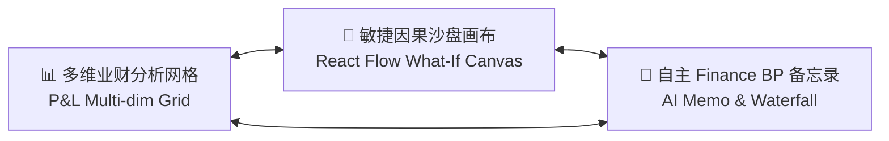
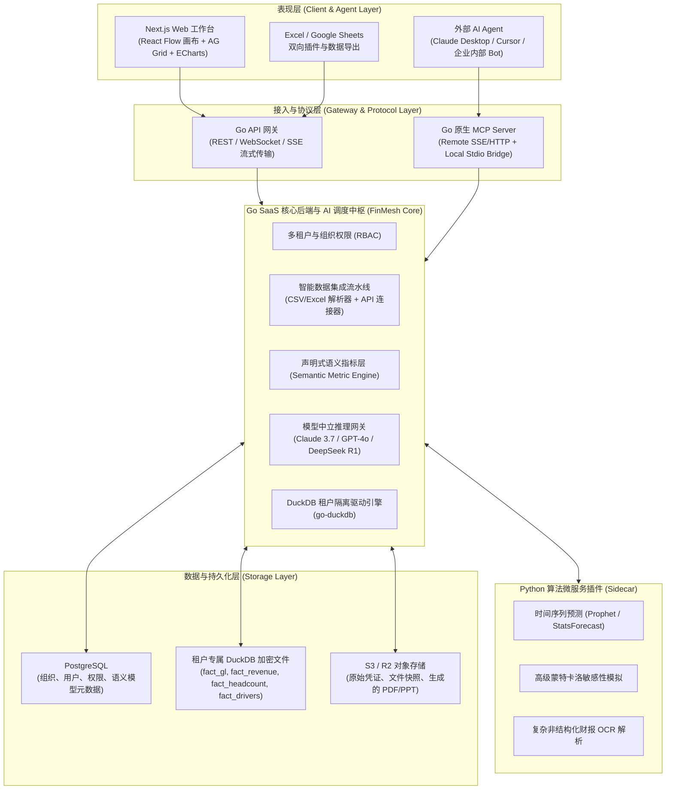
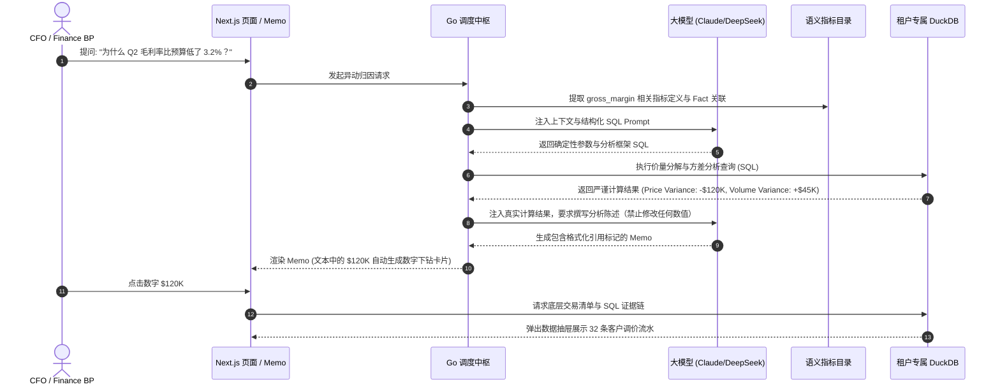

# FinMesh 🚀

> **AI-Powered FP&A + Finance BP SaaS Platform & Financial MCP Brain**  
> 新一代通用型、AI 驱动的业财融合与沙盘推演中枢，兼具现代化业财工作台与开放金融智能能力。

---

## 目录

- [1. 产品愿景与核心定位](#1-产品愿景与核心定位)
- [2. 目标客群与痛点解法 (ICP)](#2-目标客群与痛点解法-icp)
- [3. 三位一体产品交互范式](#3-三位一体产品交互范式)
- [4. 系统整体架构与技术选型](#4-系统整体架构与技术选型)
- [5. 零幻觉财务审计与数字穿透机制](#5-零幻觉财务审计与数字穿透机制)
- [6. 业财数据模型与声明式指标层](#6-业财数据模型与声明式指标层)
- [7. Financial MCP Server 规范](#7-financial-mcp-server-规范)
- [8. 技术栈清单](#8-技术栈清单)
- [9. MVP 交付范围与开发路线图](#9-mvp-交付范围与开发路线图)

---

## 1. 产品愿景与核心定位

传统 FP&A（财务规划与分析）和 Finance BP（财务业务伙伴）普遍受困于三个核心难题：
1. **数据孤岛与口径割裂**：总账科目（GL）、业务系统流水（Stripe/Shopify/CRM）与人事编制表格口径不一，每月月结财务分析师需要耗费 70% 的时间在人工清洗和对齐表格上。
2. **建模僵化与推演滞后**：传统 Excel 极度脆弱易坏，复杂的多维商业模拟无法快速响应高层与业务部门的实时“What-If”沙盘诉求。
3. **AI 在财务领域的不可信幻觉**：直接让大模型做财务计算会导致可怕的计算幻觉（算错利润、凭空捏造百分比），且没有任何数据溯源能力，无法通过 CFO 与外部审计审查。

**FinMesh 的使命**：
打造一套**以确定性计算为底座、以因果画布为表达、以自主 AI Agent 为杠杆**的业财操作系统。它不仅是供财务团队高效分析与敏捷推演的 SaaS 工作台，更是面向未来全自动 AI Agent 生态的开放**金融数据智能中枢 (Financial MCP Server)**。

---

## 2. 目标客群与痛点解法 (ICP)

FinMesh 采用兼顾高成长 SMB 与成长期中型企业（Scale-up / Mid-Market）的双轨切入策略：

| 维度 | Scale-up / Mid-Market (100 - 1000 人) | 高成长 SMB / 出海企业 (< 100 人) |
| :--- | :--- | :--- |
| **典型特征** | 业务快速迭代、有专职 Finance BP，多部门协同 | 追求轻量精简、即插即用、重视现金流与跑道 |
| **核心痛点** | 跨部门数据拉扯、Variance（预实偏差）分析耗时长、预算审批复杂 | 缺少专职财务分析师、Excel 模板混乱、无法实时掌握公司财务健康度 |
| **FinMesh 解法** | 自动化方差归因瀑布图（Waterfall）、多维权限隔离、标准 API + 数仓直连 | 智能拖拽文件入库、开箱即用标准 SaaS/电商指标看板、实时现金跑道监控 |

---

## 3. 三位一体产品交互范式

FinMesh 彻底打破传统冰冷死板的表格工具体验，融合了三大互通的工作流模块：



1. **🎨 敏捷因果沙盘画布 (Visual What-If Driver Canvas)**：
   - 基于 **React Flow** 构建直观的业财因果有向无环图（DAG）。
   - **历史期**节点自动绑定底层真实事实表（Actuals）；**未来预测期**节点转化为带动态滑块的驱动因子。
   - 拖拽滑块（如：“调整获客成本 +15%”、“推迟 2 个月招聘计划”），系统毫秒级重算 P&L 和 Cash Runway，并提供 Base / Bull / Bear 多情景同屏对比。
2. **📊 多维业财分析网格 (Dynamic Financial Grid)**：
   - 兼顾类似 Pigment / Excel 的多维报表操控习惯（基于 AG Grid）。
   - 支持自由切片（Slice & Dice）、层级折叠、版本对比（Actual vs Budget / Forecast），并支持双向 Excel / Google Sheets 导入导出。
3. **🤖 自主 Finance BP 经营备忘录 (Executive Memo & Variance Diagnosis)**：
   - 月结时 AI 自动运行方差分解，定位根本驱动因子（价量差异、部门超支、转化漏斗衰减），一键生成带 Waterfall 瀑布图与业务建议的 Executive Memo。
   - **零幻觉穿透**：文档中的所有数字均自带数据来源链接，点击即可打开穿透抽屉。

---

## 4. 系统整体架构与技术选型

FinMesh 采用 **Go 核心系统 + 轻量 Python 算法微服务 + 租户隔离 DuckDB 存储 + Next.js 现代前端** 的企业级双轨混编架构：



### 4.1 核心架构优势
- **极高并发与低能耗**：Go 语言高并发、极低内存占用与秒级启动，负责 90% 的业务逻辑、数据调度与 MCP 通信。
- **列式分析极致性能**：底层计算依托 DuckDB，内存列式矢量执行，千万级交易明细的即时聚合毫秒级完成。
- **强安全与租户物理级隔离**：每个企业租户拥有专属独立的加密 DuckDB 文件，从物理层杜绝因 LLM 拼装 SQL 遗漏 `tenant_id` 导致的跨企业财务数据泄漏。
- **算法生态无缝挂载**：通过 Python Sidecar 保留未来扩展 Prophet 时间序列与蒙特卡洛算法的能力。

---

## 5. 零幻觉财务审计与数字穿透机制

财务数据的核心底线是**精准确定性（Accuracy）与可审计性（Auditability）**。FinMesh 设立了严格的防幻觉架构规范：



### 零幻觉三原则：
1. **严禁大模型心算**：所有汇总、同比、环比、比率计算均在 DuckDB 内由确定性 SQL 执行。
2. **声明式语义约束**：指标逻辑在语义层全局唯一固化，大模型仅负责意图识别与参数映射。
3. **数字 100% 可穿透**：所有自动生成的备忘录和报告中的数值，均携带生成查询的指纹与流水溯源证据链。

---

## 6. 业财数据模型与声明式指标层

### 6.1 标准 Fact 事实表（存储于 DuckDB）
- **`fact_general_ledger`**：总账科目流水（日期、科目编码、借贷方向、金额、部门、币种、摘要）。
- **`fact_revenue_movements`**：业务/SaaS 收入异动（客户 ID、变动类型 New/Expansion/Churn、MRR/ARR、产品）。
- **`fact_headcount_roster`**：人员编制与成本（员工、岗位、部门、入离职日期、综合人头成本）。
- **`fact_operational_metrics`**：业务驱动指标（网站流量、线索数、转化率、单客成本等）。
- **`dim_scenario`**：情景维度（Actual, Budget_v1, Forecast_Q3, WhatIf_Bull 等）。

### 6.2 声明式指标定义样例 (YAML 规范)
```yaml
version: 1
metrics:
  - name: arr
    display_name: Annual Recurring Revenue
    category: Revenue
    formula: "SUM(arr_amount)"
    base_table: fact_revenue_movements
    default_filter: "movement_type != 'Churn'"
    dimensions: [customer_id, product_id, date]

  - name: gross_margin_pct
    display_name: Gross Margin (%)
    category: Profitability
    formula: "(SUM(revenue) - SUM(cogs)) / NULLIF(SUM(revenue), 0) * 100"
    derived_from: [revenue, cogs]

  - name: net_burn
    display_name: Monthly Net Burn
    category: CashFlow
    formula: "SUM(operating_expenses) + SUM(cogs) - SUM(revenue)"
    
  - name: runway_months
    display_name: Cash Runway (Months)
    category: Solvency
    formula: "latest_cash_balance / NULLIF(avg_3m_net_burn, 0)"
```

---

## 7. Financial MCP Server 规范

FinMesh 原生集成 Model Context Protocol (MCP)，支持外部 Agent（如 Claude Desktop、Cursor、企业自建 Agent）将其作为金融数据智脑直接调用：

### 核心 MCP Tools 清单：
1. `query_financial_metric`：
   - 参数：`workspace_id`, `metric_name`, `start_date`, `end_date`, `group_by`, `scenario`
   - 返回：时间序列计算数值、指标定义公式、底层执行的 SQL。
2. `explain_variance`：
   - 参数：`workspace_id`, `metric_name`, `base_scenario`, `compare_scenario`, `period`
   - 返回：自动化方差分解结果（如价量差异、部门贡献归因排序）。
3. `simulate_scenario`：
   - 参数：`workspace_id`, `driver_overrides`（如 `{"cpm_growth": 0.1, "hiring_delay_months": 3}`）
   - 返回：推演后的 P&L 变化表与现金跑道天数增减。
4. `drill_down_transactions`：
   - 参数：`workspace_id`, `metric_name`, `filters`, `limit`
   - 返回：支撑该数值的底层原始交易明细。

---

## 8. 技术栈清单

- **Frontend**: Next.js 15+ (App Router, React 19, TypeScript), Tailwind CSS, Shadcn UI, React Flow (`@xyflow/react`), AG Grid Community, ECharts.
- **Backend (Core SaaS & MCP)**: Go (Golang 1.23+), Gin/Echo, `go-duckdb`, `mcp-go`, GORM/SQLX.
- **Python Sidecar (Optional Workers)**: Python 3.11+, FastAPI, Prophet, StatsForecast.
- **Databases & Engines**: DuckDB (嵌入式列式分析), PostgreSQL 16 (关系元数据与权限), Redis (缓存与任务队列).
- **LLM Gateway**: OpenAI-compatible adapter supporting Claude 3.7 Sonnet, GPT-4o, DeepSeek-R1 / V3.

---

## 9. MVP 交付范围与开发路线图

### 阶段一：端到端垂直切片 MVP (当前重点)
- [x] 完成整体产品定义与核心架构论证 (`/grill-me`)
- [ ] 搭建 Go 后端基础骨架并集成 `go-duckdb`
- [ ] 实现标准财务 CSV/Excel（GL 总账、收入流水）拖拽入库与 DuckDB 事实表写入
- [ ] 实现声明式语义指标计算引擎（基础 P&L 核心指标）
- [ ] 实现 Go 原生 MCP Server（支持指标查询与方差归因工具）
- [ ] 搭建 Next.js 前端工作台（P&L 多维网格 + React Flow 驱动沙盘 + AI 穿透备忘录）
- [ ] 端到端实测数据平衡性与穿透下钻证据链

### 阶段二：集成拓展与双向联动
- [ ] 接入 QuickBooks, Xero, Stripe API 直接同步
- [ ] 开放 Excel / Google Sheets 双向同步插件
- [ ] 引入 Python Sidecar 支持 Prophet 时间序列趋势预测

---

*FinMesh — Empowering Finance Business Partners with Precision, Speed, and Intelligence.*
