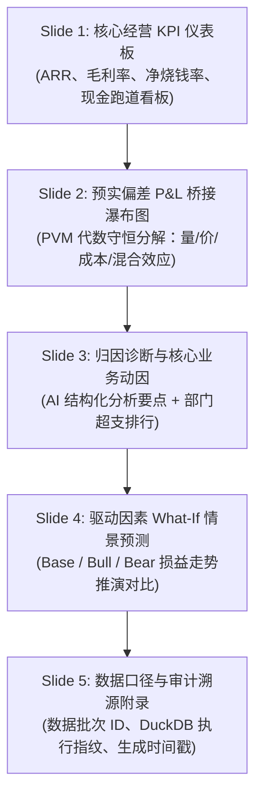

# REQ-0007: 董事会与管理层 PPT 经营分析报告一键导出 / Board & Executive Presentation PPT Auto-Generator PRD

[中文](#中文) | [English](#english)

---

<a name="中文"></a>
## 中文规范

### 1. 需求基本信息
- **需求 ID**：`REQ-0007`
- **需求名称**：董事会与管理层 PPT 经营分析报告一键导出
- **关联来源**：`SRC-0021`（PptxGenJS、Marp 与幻灯片选型）、`SRC-0001`（高管汇报与月结备忘录）、`SRC-0018`（中型企业方差归因报告）
- **所属模块**：汇报交付 (Presentation & Export)
- **目标版本**：`v0.2`
- **生命周期状态唯一维护位置**：[04-requirement-pool/requirement-pool.md](../../04-requirement-pool/requirement-pool.md)
- **责任人**：Fullstack / AI Engineer
- **前置依赖**：`REQ-0002`（声明式语义指标计算引擎）、`REQ-0004`（自主方差分析 Memo 与穿透）

---

### 2. 业务背景与用户痛点

1. `[已观察]` **月结汇报手工成本高**：每个财月结束后，FP&A 分析师需花费 2 至 3 天手工截取图表、粘贴表格、排版制作面向管理层与董事会的月度经营分析汇报（MBR）PPT（来源：`SRC-0001`、`SRC-0021`）。
2. `[已观察]` **静态切图丧失数据血缘**：传统 PPT 充斥着低分辨率静态截图；当管理层对某项支出异动提出质疑时，汇报人无法当场溯源，只能记录“会后核对”（来源：`SRC-0018`）。
3. `[推断]` **原生可编辑对象直出**：若能直接基于已通过审计的 Variance Memo（`REQ-0004`）与 DuckDB PVM 瀑布图数据，一键装配为包含原生矢量表格、可编辑文本框与原生图表的 `.pptx` 演示文稿，并在线下幻灯片备注（Speaker Notes）中附带 SQL 审计哈希，将大幅缩减报告周期并消除汇报幻觉。
4. `[待确认]` **企业自定义品牌模板兼容性**：不同企业预设的 `.potx` 母版占位符样式在纯前端装配中的保真度需在首期客户试点中评估。
5. `[未覆盖]` **多人云端幻灯片协同编辑**：本期聚焦快速、确定性的 `.pptx` 与 `.pdf` 本地交付物导出，不自建类似 Google Slides 的云端实时多人光标协同系统。

---

### 3. 用户故事 (User Stories)

- **US-01 (财务分析师)**：作为分析师，在完成月度预实方差分析后，我希望点击“导出管理层汇报 PPT”，系统在 3 秒内生成排版规范的原生 `.pptx`，下载后我可直接双击用 PowerPoint 微调文案。
- **US-02 (CFO / 汇报人)**：作为 CFO，在向董事会汇报时，我可以直接在 Web 工作台进入“全屏演讲模式”（基于 Marp/Reveal 渲染），点击任意关键指标即可唤出底层的流水穿透抽屉。
- **US-03 (董事会成员 / 审计师)**：作为审阅者，打开导出的 PPT 文件，查看幻灯片备注时能看到该页关键数字的 DuckDB 查询参数、计算公式与批次哈希，确保汇报数据经严格审计。

---

### 4. 功能性需求与技术实现标准

#### 4.1 自动装配幻灯片结构 (Standard Deck Structure)
系统按财务经营分析的标准逻辑自动生成 5 页核心幻灯片：



#### 4.2 原生可编辑 PPTX 生成引擎 (`PptxGenJS`)
- **纯原生对象**：文字使用原生文本框（支持修改字体、字号、颜色），表格使用原生 PPT Table（支持修改单元格数值），严禁整页切成图片导出。
- **图表保真**：瀑布图、柱状图与折线图生成为原生 Office Chart 对象或高精度矢量 SVG。
- **备注穿透追溯**：在每一页的 Speaker Notes 中自动写入：
  ```text
  [FinMesh Audit Trace]
  Metric: gross_margin_pct
  Scenario: Actual vs Budget_v1 (2026-08)
  Formula: (revenue - cogs) / revenue * 100
  DuckDB Query Hash: 7f8c02a1d
  Generated At: 2026-09-27T23:00:00Z
  ```

#### 4.3 浏览器全屏演示模式 (Marp / Web Slides)
- 前端同时支持将 Variance Memo 渲染为 Marp 结构化 Markdown 幻灯片。
- 支持全屏翻页、演讲者视图，且幻灯片中的数字组件仍保持 `<MetricToken />` 的可点击交互能力。

---

### 5. 验收标准 (Acceptance Criteria)

- [ ] **AC-01 (导出文件合法性)**：导出的 `.pptx` 文件可被 Microsoft PowerPoint (Office 365 / 2019+) 与 Apple Keynote 正常打开，无文件损坏或修复警告。
- [ ] **AC-02 (原生对象可编辑性)**：打开 PPT 后，文本框内容可双击编辑，表格单元格可修改数值，图表非位图切图。
- [ ] **AC-03 (数值绝对一致性)**：PPT 中所有指标数值与 Variance Memo、多维损益表网格的数值完全一致（误差 $\le 0.0001$）。
- [ ] **AC-04 (生成性能)**：包含 5 页标准幻灯片的 PPT 导出操作在前端处理时间 $\le 3000\text{ms}$，生成的 `.pptx` 体积 $\le 5\text{MB}$。
- [ ] **AC-05 (审计备注覆盖率)**：所有包含指标数值的幻灯片页，其 Speaker Notes 中均包含格式合规的 `[FinMesh Audit Trace]` 溯源码。

---

<a name="english"></a>
## English Specification

### 1. Requirement Metadata
- **Requirement ID**: `REQ-0007`
- **Name**: Board & Executive Presentation PPT Auto-Generator
- **Sources**: `SRC-0021` (PptxGenJS, Marp & Presentation Tech Selection), `SRC-0001` (Executive Briefings & Monthly Memos), `SRC-0018` (Mid-Market Variance Reporting)
- **Module**: Presentation & Export
- **Target Version**: `v0.2`
- **Lifecycle Status Source of Truth**: [04-requirement-pool/requirement-pool.md](../../04-requirement-pool/requirement-pool.md)
- **Owners**: Fullstack / AI Engineer
- **Dependencies**: `REQ-0002` (Semantic Metric Engine), `REQ-0004` (Autonomous Variance Memo & Audit Drill-down)

---

### 2. Business Context & Pain Points

1. `[Observed]` **Labor-Intensive MBR Assembly**: FP&A analysts spend 2 to 3 days each monthly close manually taking screenshots, copying financial tables, and aligning layouts for monthly executive and board presentations (Sources: `SRC-0001`, `SRC-0021`).
2. `[Observed]` **Loss of Audit Trail in Static Screenshots**: Static image slides lack data lineage; when directors challenge an unexpected variance, presenters cannot drill down on the spot and must defer to offline investigation (Source: `SRC-0018`).
3. `[Inferred]` **Native Editable Presentations**: Auto-generating native editable presentations directly from audited Variance Memos (`REQ-0004`) and DuckDB PVM waterfall data dramatically reduces reporting turnaround while providing verifiable audit tokens in presentation speaker notes.
4. `[To-Confirm]` **Corporate Template Fidelity**: The degree of stylistic fidelity across heterogeneous corporate `.potx` master slide layouts during browser-side generation needs validation during initial customer pilots.
5. `[Uncovered]` **Cloud Multiplayer Co-editing**: This milestone focuses on deterministic, offline `.pptx` and `.pdf` file generation rather than a real-time multiplayer co-editing suite like Google Slides.

---

### 3. User Stories

- **US-01 (FP&A Analyst)**: As an analyst completing month-end variance analysis, I want to click "Export Executive Deck" and receive a cleanly styled `.pptx` within 3 seconds so I can tweak commentary in PowerPoint before the meeting.
- **US-02 (CFO / Presenter)**: As a CFO presenting to the board, I want to switch to fullscreen presentation mode directly in the web app, retaining interactive click-to-drilldown on every metric token.
- **US-03 (Board Director / Auditor)**: As a board director reviewing the presentation, I want speaker notes to contain the exact DuckDB query parameters, formulas, and batch verification hashes backing each key figure.

---

### 4. Functional Specifications

#### 4.1 Standard 5-Slide Executive Deck Structure
1. **Slide 1: Core KPI Scorecard**: ARR, Gross Margin %, Monthly Net Burn, Runway Months.
2. **Slide 2: Actual vs Budget P&L Bridge**: Conservative PVM waterfall breakdown (Volume, Price, Cost, Mix effects).
3. **Slide 3: Root Cause & AI Diagnosis**: Structured narrative bullets and departmental overspend rankings.
4. **Slide 4: Driver-based What-If Forecast**: Base vs Bull vs Bear trajectory charts.
5. **Slide 5: Audit Appendix & Lineage**: Batch IDs, DuckDB query execution fingerprints, and timestamps.

#### 4.2 Native PowerPoint Engine (`PptxGenJS`)
- **Native Shapes**: Rendered as native text boxes, native tables, and native vector charts—strictly prohibiting full-page raster screenshot exports.
- **Embedded Speaker Notes**: Each slide automatically includes structured audit metadata:
  ```text
  [FinMesh Audit Trace]
  Metric: gross_margin_pct
  Scenario: Actual vs Budget_v1 (2026-08)
  Formula: (revenue - cogs) / revenue * 100
  DuckDB Query Hash: 7f8c02a1d
  Generated At: 2026-09-27T23:00:00Z
  ```

#### 4.3 Browser Fullscreen Presentation Mode
- In-browser Marp-compatible markdown presentation viewer with interactive `<MetricToken />` drilldown drawers.

---

### 5. Acceptance Criteria

- [ ] **AC-01 (Format Validity)**: Generated `.pptx` files open cleanly in Microsoft PowerPoint (Office 365 / 2019+) and Apple Keynote without corruption prompts.
- [ ] **AC-02 (Native Object Editability)**: Text boxes, tables, and charts are fully editable native shapes inside presentation software.
- [ ] **AC-03 (Numerical Consistency)**: All numbers match the source Variance Memo and P&L Grid without rounding discrepancies ($\Delta \le 0.0001$).
- [ ] **AC-04 (Generation Latency)**: Complete 5-slide deck assembly completes in $\le 3000\text{ms}$ with file size $\le 5\text{MB}$.
- [ ] **AC-05 (Audit Notes Coverage)**: 100% of metric-bearing slides include valid `[FinMesh Audit Trace]` blocks in speaker notes.
